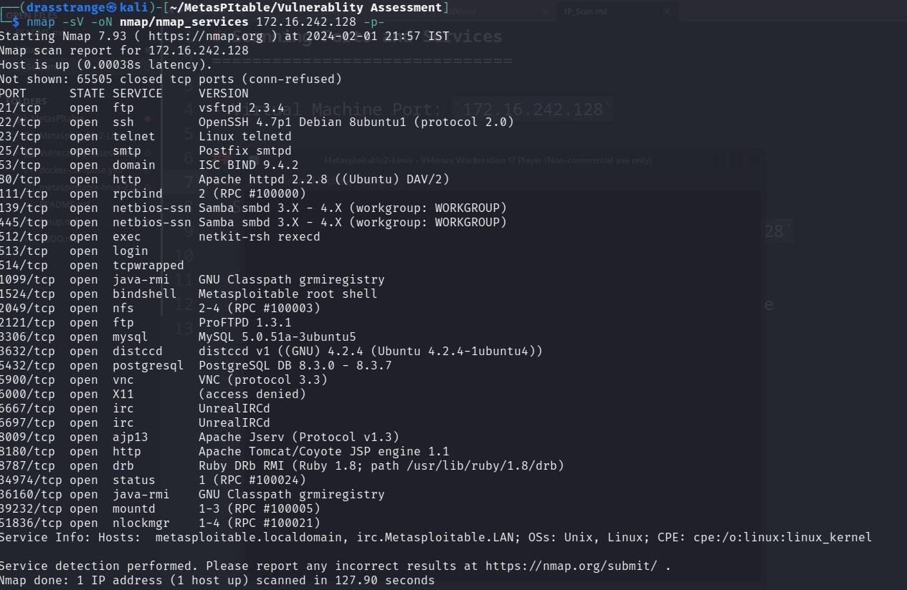

# Scanning Ports and Services
------------------------------
- Virtual Machine IP: `172.16.242.128`
- One of the crucial steps in vulnerabiblity assessment or PenTesting is identifying open ports and services running on them. These open ports can serve as an intial foothold because of various vulnerabilites or misconfigurations.

## Full Nmap Scan
------------------
- Scanning all open ports and services using:
	- `nmap -sV -p- -oN nmap/nmap_services 172.16.242.128`
	- `-sV`: Scan for services on port
	- `-p`: Scan for all ports
	- `-oN`: Save Nmap output in nmap/nmap_services file
	
	

## 