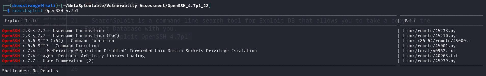
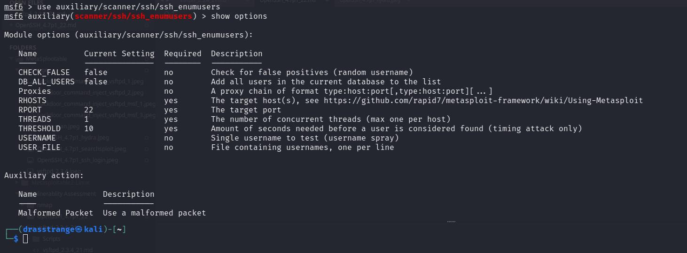
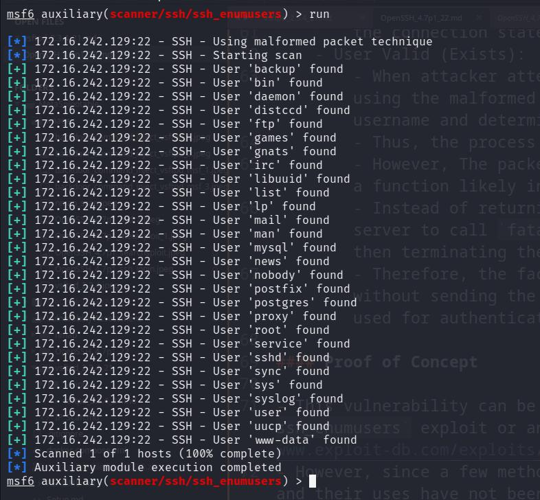
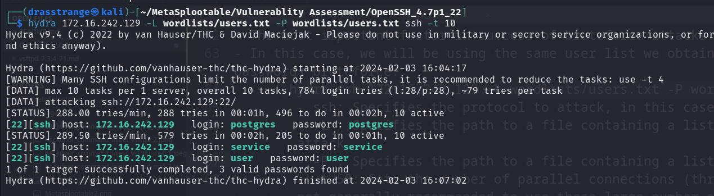
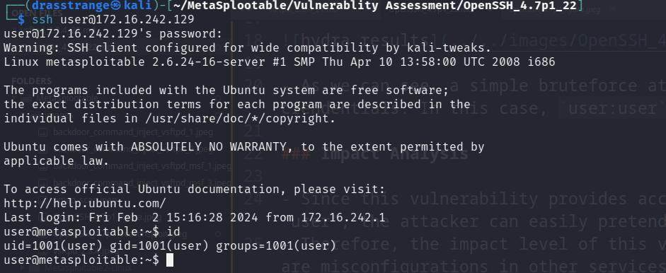

# OpenSSH 4.7p1

## Introduction

- OpenSSH is a suite of secure networking utilities based on the Secure Shell protocol, which provides a secure channel over an unsecured network in a client–server architecture.
- Port: 22 which is the default SSH port.

## Searchsploit

- SearchSploit is a command-line search tool for Exploit-DB that allows you to take a copy of the Exploit Database with you.
- `searchsploit OpenSSH 4.7p1`

- SearchSploit reveals that there is a `Username Enumeration` vulnerability present in 4.7p1 version of SSH.

### OpenSSH 4.7p1 - Username Enumeration - (CVE: 2018-15473)

- This vulnerability is based on an attacker crafting a malformed packet, such as a truncated packet, which is intended to disrupt the normal authentication process. This packet is designed to exploit the way OpenSSH handles error conditions during authentication.
- This vulnerability allows the attacker to enumerate valid users present on the server. The attacker sends a  malformed packet. This is done by handling 2 possible cases:
	- User Invalid (Does Not Exist):
		- When attacker attempts to authenticate with a username that does not exist on the server using the malformed packet, the `userauth_pubkey()` function (which is part of the authentication process) checks the validity of the username and determines that it is invalid.
		- Since the username does not exist, `userauth_pubkey()` returns immediately, and as part of the standard error handling, the server sends an `SSH2_MSG_USERAUTH_FAILURE` message back to the attacker.
		- This message is a standard response indicating that the authentication attempt has failed, but it does not cause the server to terminate the connection.
		- The `SSH2_MSG_USERAUTH_FAILURE` message and the fact that the server doesn't terminate the connection states that the username used for authentication was indeed invalid.
	- User Valid (Exists):
		- When attacker attempts to authenticate with a username that exists on the server using the malformed packet, the `userauth_pubkey()` function checks the validity of the username and determines that it is valid.
		- Thus, the process of authenticating the attacker with the provided username continues.
		- However, The packet's malformed nature eventually causes a failure in `sshpkt_get_u8()`, a function likely involved in parsing packet data.
		- Instead of returning an error message as in the previous case, this failure leads the server to call `fatal()`, a function that handles critical errors by logging the error and then terminating the connection.
		- Therefore, the fact that the server closes its connection to the attacker abruptly, without sending the standard SSH2_MSG_USERAUTH_FAILURE message states that the username used for authentication was valid.

#### Proof of Concept

- This vulnerability can be exploited either through Metasploit's `auxiliary/scanner/ssh/ssh_enumusers` exploit or an manually crafted script or a script obtained from ExploitDB (https://www.exploit-db.com/exploits/45233).
- However, since a few methods using external python2 libraries used in the script are deprecated and their uses have not been updated in the script, I will be using Metasploit to exploit this vulnerability on Metasploitable VM.

- Metasploit Exploitation:
	- Start metasploit using:
		- `msfconsole`
	- Using the auxiliary/scanner/ssh/ssh_enumusers exploit:
		- `use auxiliary/scanner/ssh/ssh_enumusers`
	- Viewing the required options for exploitation:
		- `show options`

		

	- The only 2 required options is `RHOSTS` which is the target IP and the `USER_FILE` wordlist to bruteforce on the OpenSSH server. I will be using metasploit's `unix_users.txt` wordlist for username bruteforce:
		- `set RHOSTS IP_ADDRESS`
		- `set /usr/share/metasploit-framework/data/wordlists/unix_users.txt`
	- Run the exploit using:
		- `exploit` or `run`

- As we can see, we got a lot of usernames in the system using this vulnerability.
- We can store these usernames in a file for further exploration of these user accounts on the system in future.

## Bruteforcing via Hydra

- Default and weak passwords are vulnerable to bruteforce attacks leading to unauthorized access via SSH.
- The most important factor in success of bruteforce attacks is choosing the right wordlist.
- In this case, we will be using the same user list we obtained previously for both users and passwords bruteforce:
	- `hydra ssh 172.16.242.129 -L wordlists/users.txt -P wordlists/users.txt -t 10`
		- ssh: Specifies the protocol to attack, in this case, SSH.
		- -L : Specifies the path to a file containing a list of usernames to try during the attack.
		- -P : Specifies the path to a file containing a list of passwords to attempt.
		- -t 10: Sets the number of parallel connections (threads) to use for the attack. It is not generally recommanded to use these large number of threads as they can trigger security mechanisms on the target but since this is on our local machine, 10 threads are fine.

- As we can see, a simple bruteforce attack using automated tools such as hydra can reveal weak crendentials. In this case, we obtained the following credentials:
	- `postgres : postgres`
	- `service : service`
	- `user : user`

### Proof of Concept

- We can use automated tools and scripts like hydra or metasploit to bruteforce or try to guess common passwords and usernames.
- We can use the obtained credentials (user:user) to login via SSH:
	- `ssh user@IP_ADDRESS`
	- Enter password: `user`

	

## Impact Analysis

### OpenSSH 4.7p1 - Username Enumeration - (CVE: 2018-15473)

- The user enumeration vulnerability is a threat to data confidentiality since it can leak user names present on the server.
- Therefore, the impact level of this vulnerability is medium since it alone does not provide any access as discovered users on the server.

### Weak Credentials

- Since this vulnerability provides access to the sytem and full access of the system as the user "user", the attacker can easily pretend to be the original user and modify/harm the system files.
- Therefore, the impact level of this vulnerability is high and can even be more harmful if there are misconfigurations in other services running as high priveleged user to chain this vulnerability on the system providing the super user access to the attacker.

## Patches and Updates:

- The developers of OpenSSH responded to this vulnerability and released newer versions of the software with security patches and fixes.
- All users were advised to update to the latest version as soon as possible to protect their servers from exploitation.

## Mitigations

- Use Strong Passwords: Implement strong, complex passwords that are difficult to guess.
- Change the Default SSH Port: Change the default port (22) to a non-standard port to reduce the risk of automated attacks.
- Limit SSH Access by IP: Restrict SSH access to known IP addresses or ranges through firewall rules or SSH configuration.
- Monitor SSH Access Logs: Regularly monitor SSH logs for unauthorized access attempts and take action accordingly.
- Keep SSH Software Up-to-Date: Regularly update SSH server software to ensure all security patches are applied.

## Conclusion

- Demonstrated critical vulnerability in OpenSSH 4.7p1 allows for user enumeration, highlighting significant security risks.
- Utilization of tools like SearchSploit and Metasploit effectively identifies and exploits vulnerabilities.
- Emphasized the high impact of the vulnerability, necessitating immediate mitigation to prevent unauthorized access.
- Recommended actionable steps include strong passwords, changing default SSH ports, and regular software updates to enhance security.
- The report underscores the importance of continuous security practices to protect against potential exploits.

## References

- https://www.exploit-db.com/exploits/45233
- https://www.cvedetails.com/vulnerability-list/vendor_id-97/product_id-585/version_id-430455/Openbsd-Openssh-4.7p1.html?page=1&order=1&trc=31&sha=a0f995a88b5436a219ecc740747bbdf897e89a10
- https://isc.sans.edu/diary/OpenSSH+user+enumeration+CVE201815473/24004/ 

